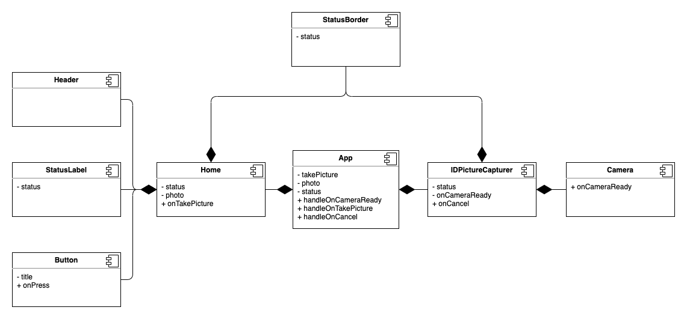

# BankClient

## Introduction
BankClient is an mock app that simulates ID card validation using the device camera.

## Functional description

### Use example

## Technical description

### Components

## TODO
- Improve testing (UI testing and integration testing)
- Improve Documentation
- Implement Redux
- Refactor to TypeScrypt
- Styles fine tunning